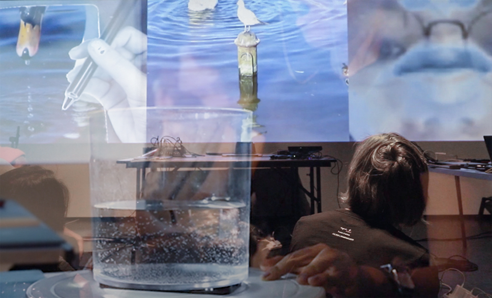

# Give-me-a-sec

A seagull wanders by a lake, thinking to take off in the next second but it hesitates.

Video and project details check the project page [HERE](https://bingcomputing.hotglue.me/?giveMeASec)

-

2019

Experimental performance

#Max/MSP/Jitter

-

The performance describes a daily panic in the flow of time caused by the paradox between our internal and external self.

With a rhythmic repetitive chant of a list of phrases descriptive of states of individuals pondering before taking actions with an awareness of the flowing time, a video shows a seagull facing a lake, hesitating to fly away. And in the next scene, the seagull stands in the middle of the lake, although there’re other birds swimming/flying around, it still stops there. Suddenly its reflection in the lake flies away, leaving the still entity there. Then after a while, the seagull entity disappears in the middle of the lake.

The flowing lake is a representation of time. The states of the seagull and its reflection represent the paradox between our external and internal beings. Sounds are live-manipulated by the performer’s mouth and a rotating clear vessel with water in it. The mouth responds to the state of ‘speaking with hesitation’ and the spinning water responds to a flowing time.

The videos and sound environments are coded and amplified in Max, while receiving messages from an openFramework faceOSC and a phone GyrOSC.
